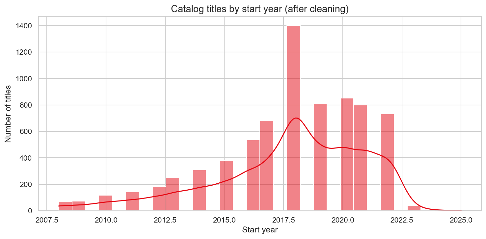
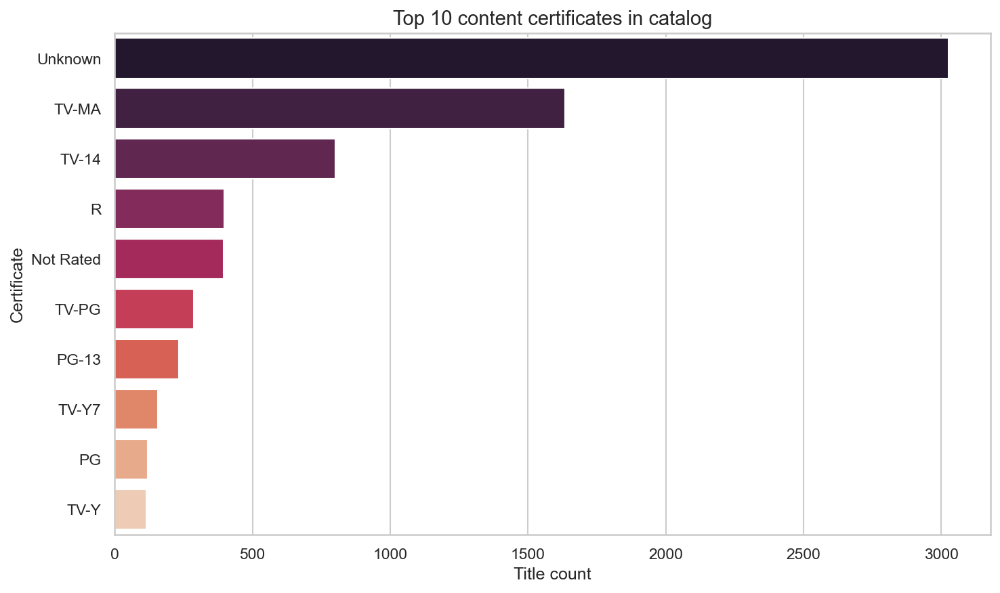
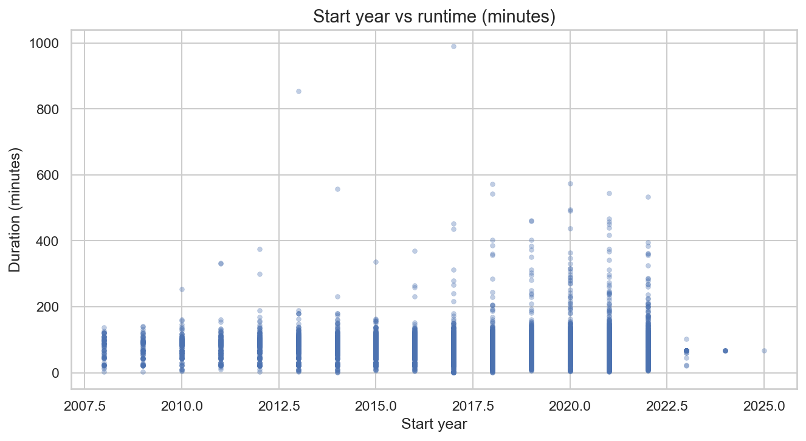
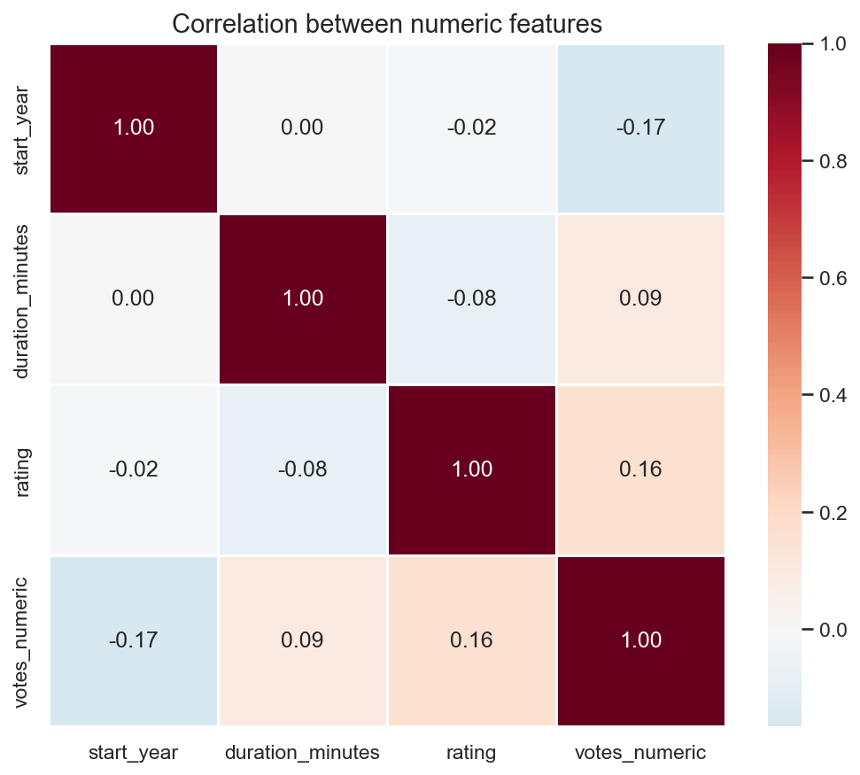

# Final report — Data cleaning & visualization

**Project:** Movie Catalog Data Cleaning and Visualization
**Dataset:** Movie and streaming-content catalog (`n_movies.csv`)
**Author:** DUGGISETTY NEHA SREE

**Date:** 10-05-2026

---

## 1. Executive summary

This report summarizes cleaning and exploratory visualization of a streaming-style title catalog. The source table lists titles with IMDb-oriented fields (year range, certificate, duration, genre, rating, votes). After handling missing values, duplicate titles, and outliers on the derived start year, the cleaned dataset was saved and four charts were produced to describe year distribution, content certificates, runtime versus year, and correlations among numeric features.

The dataset contained 9957 raw rows, reduced to 7376 after cleaning. Titles span from 2008 to 2025, with a mean IMDb rating of 6.56. Most titles were released after 2010, with TV-MA being one of the most common certificates.Recent titles generally showed higher vote counts, indicating stronger audience engagement in modern streaming content.

---

## 2. Data source and dictionary

| Item | Detail |
|------|--------|
| **Primary path (typical)** | `%USERPROFILE%\Downloads\netfilx\n_movies.csv` |
| **Alternate** | `movie-data-analysis/data/n_movies.csv` |
| **File analyzed** | `movie-data-analysis/data/n_movies.csv` |
| **Format** | CSV, comma-separated |

### Column reference

| Column | Description |
|--------|-------------|
| `title` | Title of the show or movie |
| `year` | Display string such as `(2016– )` or `(2008–2013)` |
| `certificate` | Content rating (e.g. TV-MA, PG-13); may be empty |
| `duration` | Runtime string, typically `NN min` |
| `genre` | One or more genres, comma-separated |
| `rating` | IMDb-style average score (numeric) |
| `description` | Short synopsis |
| `stars` | Cast / credits text |
| `votes` | Vote count (may include thousands separators) |

### Derived fields (created in code)

| Field | Rule |
|-------|------|
| `start_year` | First four-digit year extracted from `year` |
| `votes_numeric` | `votes` with commas removed, converted to number |
| `duration_minutes` | Minutes parsed from `duration` |

---

## 3. Cleaning methodology

| Step | Action | Rationale |
|------|--------|-----------|
| 1 | Load CSV; build derived numeric columns | Enables consistent typing for plots and correlation |
| 2 | Inspect shape, dtypes, missing counts | Avoid blind transformations |
| 3 | Missing values: text → `Unknown`, numeric → median | Keeps rows usable for aggregation; median resists skew |
| 4 | Duplicates: drop by `title` (first kept) | Reduces double-counting of the same listing |
| 5 | Outliers: IQR on `start_year` (factor 1.5) | Removes extreme erroneous years while keeping most data |
| 6 | Save cleaned CSV | Reproducible downstream analysis |

**Rows**

| Stage | Count |
|-------|-------|
| Raw rows loaded | 9957 |
| After deduplication | 7912 |
| After outlier removal | 7376 |

**Output file:** `movie-data-analysis/data/cleaned_movies.csv` (path relative to project root).

## 4. Findings

- Years: Most titles were released between 2008 and 2025, with a mean start year around 2018.
- Certificates: TV-MA and TV-14 were among the most common content ratings.
- Runtime vs year: Scatter plot shows variation in duration across years, with no strong linear trend.
- Correlations: Votes and ratings showed a mild positive correlation; duration and year had weak relationships.
- Overall:The dataset primarily represents modern streaming-era content with strong audience engagement for recent releases.

## 5. Visualizations

All figures are generated by `notebooks/analysis.ipynb` and stored under `visuals/`.

| File | Type | Description |
|------|------|-------------|
| `histogram_release_year.png` | Histogram (+ KDE) | Distribution of start (or release) year after cleaning |
| `countplot_content_type.png` | Horizontal count plot | Top 10 `certificate` values (`n_movies` mode) or `type` (demo mode) |
| `scatter_year_vs_duration.png` | Scatter | Start year vs `duration_minutes` |
| `correlation_heatmap.png` | Heatmap | Pearson correlation between numeric features |

---

## 6. Limitations and next steps

**Limitations**

- Duplicate removal by `title` does not distinguish remakes or regional duplicates.
- IQR outlier removal on year may drop valid very old titles; adjust the IQR factor if needed.
- `votes` and `rating` can be missing or inconsistent in scraped sources.

**Next steps**

- Split `genre` into binary columns (multi-label encoding) for genre popularity analysis.
- Parse `year` into start and end years where ranges are closed (e.g. `2008–2013`).
- Compare subsets (e.g. certificate × mean rating) with grouped tables or small multiples.

---

## 7. Reproducibility

```bash
cd movie-data-analysis
pip install -r requirements.txt
jupyter notebook notebooks/analysis.ipynb
```

Run **Run All**, then copy metrics from section **“Summary for final_report.md”** in the notebook into section 3 of this document.

---

## Visual Outputs

### Release Year Histogram


### Content Certificate Count Plot


### Runtime vs Year Scatter Plot


### Correlation Heatmap
